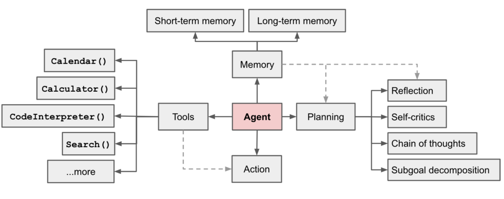

### Agent介绍
参照 [Chrome-GPT](https://github.com/richardyc/Chrome-GPT)，本项目采用 langchain 提供的 AutoGPT 模块来实现的。为更好的展开说明，先了解一下Aggent的组成，如下图：



一个Agent主要由Tools、Planning、Memory组成，其中Action是Agent根据Plan选择合适的Tool后执行该Tool的过程。虽然这些部分是分开的，但在agent的prompt中这几部分内容都有所体现。以本项目为例，agent的prompt主要包含以下几个段：
- `Goals`：任务的目标
- `Plans`：过去完成的步骤和后续要完成的步骤。
- `Commands`：可用的命令，格式一般为 `命令名：命令描述`；
- `Format`：要求GPT回复内容所遵循的格式；
- `Constraints, Resources等`：一些给GPT的限制条件等；

本项目中可以通过传入`-v`参数来输出每一步的Prompt。

### Goals设置 和 遇到的问题

goals是一个字符串列表，每条字符串表示一个goal。

本项目中的一个问题是goal之间的信息传递，比如目标设置为：
```text
f"Obtain the resource usage of the process whose pid is {pid} over a period of time, then analyze the process's resource usage based on statistical information and save above statistical information and analyse result to the markdown file. "

```
这个任务一般会拆分为这样的一些目标：
- Use the 'sample' command to monitor the process with {pid} .
- Analyze the process's resource usage based on the statistical information obtained.
- Save the statistical information and analysis result to a markdown file.


但在第三个goal中，需要将前两个goal收集到的信息放入到同一个文件夹中，虽然这些信息都存放在了历史记录中，但agent在完成这个goal时会用更简洁的表达方式来概括之前的信息，导致分析或数据变得不那么详细。

### Tools的设置 和 遇到的问题

本项目中主要有四个Tool：
1. sample: useful to get a dictionary that contains recorded metrics for the monitored process, including CPU usage percentages, memory usage values (in bytes), I/O read and write bytes, and the number of network connections over time, args json schema: {"pid": {"title": "Pid", "description": "The process ID (PID) of the process to monitor.", "type": "integer"}}
2. analyse_process: Analyzes the resource usage of a process based on the provided statistical information., args json schema: {"tool_input": {"type": "string"}}
3. terminal: Run shell commands on this Linux machine. It is useful when you need to monitor or collect resource usage information of a process, or when you need to perform file read/write operations and various terminal commands., args json schema: {"commands": {"title": "Commands", "description": "List of shell commands to run. Deserialized using json.loads", "anyOf": [{"type": "string"}, {"type": "array", "items": {"type": "string"}}]}}
4. duckduckgo_search: A wrapper around DuckDuckGo Search. Useful for when you need to answer questions about current events. Input should be a search query., args json schema: {"query": {"title": "Query", "type": "string"}}

存在的问题是Agent并不能充分发挥每一个工具，如果我只提供terminal工具，那么Agent在收集进程的资源使用数据时可能只使用`ps`和`top`工具，得到的信息比较有限。

后面我增加了一个自定义的工具`sample`，它会在2.5s内对指定进程采样50次，采样信息包括cpu使用率、内存、IO、网络连接的使用情况。

但依然存在一些问题，因为agent在使用工具获取进程信息时主要使用`sample`，进程的其他很多有价值的信息并没有进行收集和分析，比如：
- 火焰图：这可以通过profile工具获取，然而由于火焰图包含的信息过多，占用较长的token数量，GPT分析起来存在困难，因而本项目中并没有去收集这类信息；
- `/proc`文件夹下的各类数据：例如进程对应的可执行文件和打开的文件，分别位于`/proc/pid/exe`和`/proc/pid/fd`。但`/proc/pid/exe`有时并不对应具体的源代码文件，比如在执行python代码时`/proc/pid/exe`对应的是python命令的路径，而不是用户编写的python代码文件的路径。这些问题使得从源代码角度来分析进程变得困难；
- 监测工具：可以指定pid来监测进程的各类信息，但如何让agent选择合适的监测工具依然是一个问题。


### Memory设置
在langchain提供的AutoGPT模块中，历史信息会保存在数据向量库中，在构造prompt时从历史记录中检查是否有相关信息，有的话添加到prompt中。我实践的时候发现这个设计的用处不是很大。更重要的是让Agent知道执行过的历史步骤，避免Agent在执行完一个Plan后立刻遗忘该Plan导致重复执行，所以我在prompt中添加了`Completed plans`和对应的结果以及`Future Plans`。

不过这些内容存在token过长的风险，可以将内容进行summary再进行记录。

### 待改进的地方

有很多地方有待改进，但受限于个人能力不易实现。除了上面提到的问题，目前该工具的执行时间较长，Agent每个周期的执行时间在30s以上。统计数据也可以借助python以图表形式展示，但如何将历史信息进行有效组合依然是一个问题。

### 参考项目

本项目的代码实现上主要参考了两个项目：
- [mini-agi](https://github.com/muellerberndt/mini-agi)：这个项目算是agent的最简实现，代码不多也很简洁。
- [Chrome-GPT](https://github.com/richardyc/Chrome-GPT)：这个项目采用langchain提供的AutoGPT模块完成开发，结合langchain提供的其他工具可以更快的完成agent的开发。

其他可供参考的项目还有 [babyagi](https://github.com/yoheinakajima/babyagi/tree/main)，[AgentGPT](https://github.com/reworkd/AgentGPT), [shell_gpt](https://github.com/TheR1D/shell_gpt/tree/main) 等。

